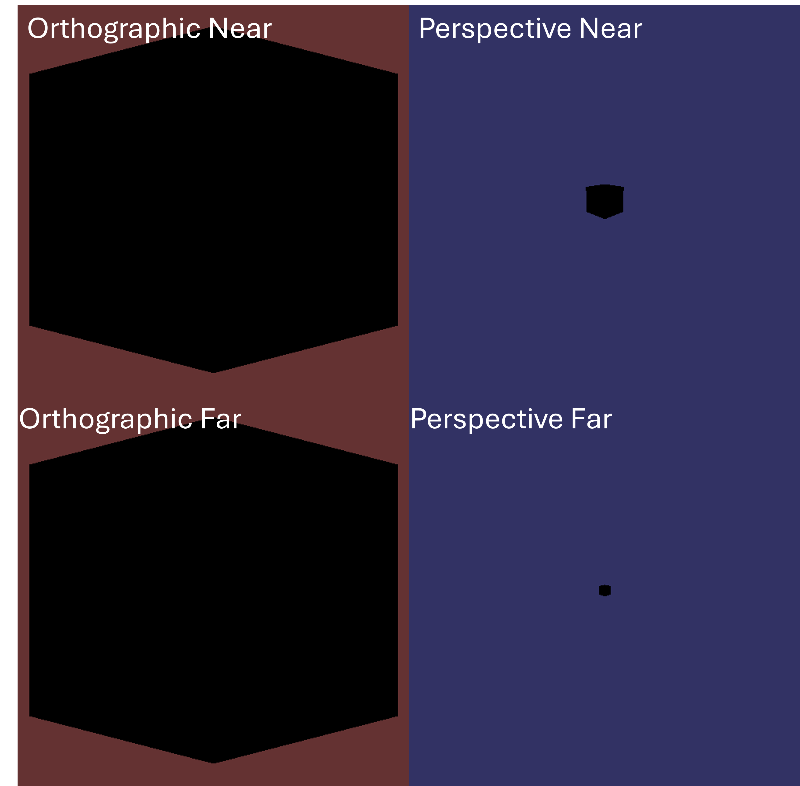
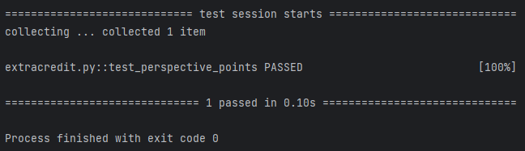

# Programming Assignment 5

Class: CS 4204 (Computer Graphics), Fall 2024

Professor: Brendan David-John

## Overview

In this programming assignment, you are going to complete the fifth step towards building our renderer: extending 
the camera module and adding the basic render loop. To begin, you will extend the camera module created in the last 
assignment by adding a `PerspectiveCamera` class. You will also create a `renderer.py` file which contains the 
`Renderer` class. Eventually, this class will be given all of the needed elements to render an image, and then 
perform the render and shading loop. In this assignment, the `Renderer` class will simply render a silhouette of an 
object.


## Instructions

For this assignment, you will modify `camera.py`, and add a class called `PerspectiveCamera`. `PerspectiveCamera` 
is almost identical to `OrthoCamera`, and needs to be implemented as detailed below. As the name suggests, 
`PerspectiveCamera` will provide the functions necessary to perform a perspective projection transformation (as 
opposed to an orthographic projection transformation).

Once you have the perspective camera implemented, we need a way to perform the basic render loop so we can actually 
begin to render our scene. This is going to be very similar to the extra credit from the previous assignment. You 
will need to create a `renderer.py` file, and within it, create a `Renderer` class, as described below.

This assignment will only make use of visual checks to validate your solutions.

Tip: It may be beneficial to add a `device_to_screen(self,p)` function or similar to your Screen class for normalized device coordinates (-1,1) to screen coordinate (pixels) transformation.

### Output

There are a total of 5 scripts that can be executed. `extracredit.py` is what will be run to evaluate the extra credit. There are 4 scripts that follow the `assignment5_X_Y.py` pattern, where `X` is either `ortho` or `perspective` and `Y` is either `near` or `far`. Everything in these scripts is identical except for the camera type (either `OrthographicCamera` or `PerspectiveCamera`) and the distance the camera is from the mesh (5 for `near` and 15 for `far`). The following image is a collage of running all of them:



Notice that the apparent image does not change not change for the orthographic camera as the camera moves away from 
the mesh, whereas the perspective camera does.

### Dependency Management
Each assignment will include a requirements.txt file that includes the python package requirements for the assignment. If you are using PyCharm it should automatically detect and install the dependencies when you create the virtual environment. Otherwise, [these instructions](https://www.jetbrains.com/help/pycharm/managing-dependencies.html#configure-requirements) will help you manually manage the requirements in PyCharm. If you are using something other than PyCharm, you can use the command line to manually install the packages from the requirements.txt file:

```bash
pip install -r requirements.txt
```

## The `PerspectiveCamera` Class

### Exposed Members

#### `transform`
A `Transform` object exposed to set the orientation (position and rotation) of the camera. This should default to 
represent a position of `(0, 0, 0)` and no rotation.

### Exposed Methods

#### `__init__(self, left, right, bottom, top, near, far)`
The constructor takes six floats as arguments: `left` ,  `right`,  `bottom`,  `top`,  `near`, and `far`. These 
arguments define the orthographic projection of the camera used to construct the orthographic transformation. You 
can then use the `near` and `far` values to construct the perspective matrix. Using these two matrices is how you 
then convert a point from camera space to device space in the method `project_point`. You should also construct the 
inverse matrices for both the orthographic and projective transformations, as those will both be used in the method 
`project_inverse_point`. The camera `transform` should be initialized with the `Transform` default constructor.

#### `ratio(self)`
This method simply returns a float that is the ratio of the camera projection plane's width to height. That is, if the screen width is 6 in world space and the screen height is 3, then this method would return `2.0`.

#### `project_point(self, p)`
This method takes a 3 element Numpy array, `p`, that represents a 3D point in world space as input. It then 
transforms `p` to the camera coordinate system before performing the perspective projection using  
and returns the resulting 3 element Numpy array.

#### `inverse_project_point(self, p)`
This method takes a 3 element Numpy array, `p`, that represents a 3D point in normalized device coordinates as input. It then transforms `p` to the camera coordinate system before transforming back to world space returns the resulting 3 element Numpy array.

## The `Renderer` class

### Exposed Members
There are no exposed members

### Exposed Methods

#### `__init__(self, screen, camera, mesh)`
The class constructor takes a screen object (of type `Screen`), and camera object (either of type `OrthoCamera` or 
`PerspectiveCamera`), and a mesh object (of type `Mesh`) and stores them.

#### `render(self, bg_color)`
This method will take a single argument, `bg_color`, for now. `bg_color` is a three element list that is to be the 
background color of the render (that is, all of the pixels that are not part of a mesh). `render` will execute the 
basic render loop that we discussed in class to construct an image buffer. It will then draw that image buffer to 
the `screen` object using the `screen.draw` method, but it will not need to run the pygame loop (the calling function will 
call `screen.show`)

For this assignment, the render loop will not perform any computational shading (this will change in future 
assignments). Instead, the render loop for this assignment will simply color a pixel black (color value `[0, 0, 0]`) 
if the pixel "contains" a point on a mesh, and it will color the pixel the provided background color if it does not 
"contain" a point. NOTE: this means that there is no requirement to implement a z-buffer or normal culling at 
this stage.


## Extra Credit
Extra credit for this assignment will be to create a static method for the `PerspectiveCamera` class with the 
signature `FromFOV(fov, near, far, ratio)` where `fov` is the camera's horizontal field of view in degrees, `near` is 
the 
distance to the near clipping plane,`far` is the distance to the far clipping plane, and `ratio` is the pixel ratio 
of the final image (the value returned from `screen.ratio()`). 
This static method 
will 
then compute `left`, `right`, `top`, and `bottom` to create a `PerspectiveCamera` object. To do this, we will assume 
that `left` and `right` are symmetric, as are `top` and `bottom`. Finally, we will also assume that our pixels are 
square. To test for extra credit, we will run pytest on the `extracredit.py` file (it is already provided, and you 
should not edit it). The extra credit point will be provided if the single test passes.





## Rubric
There are 10 points (11 with extra credit) for this assignment:
- *10 pts*: The images produced from the `assignment5_X_Y.py` scripts are as expected (see above)
  - *5 pts*: The cube is correctly rendered for the orthographic images
  - *2 pts*: The perspective images are different (the object is smaller) than the orthographic images
  - *3 pts*: The object in the "far" perspective image is proportionately smaller than the object in the "near" 
    perspective image.
